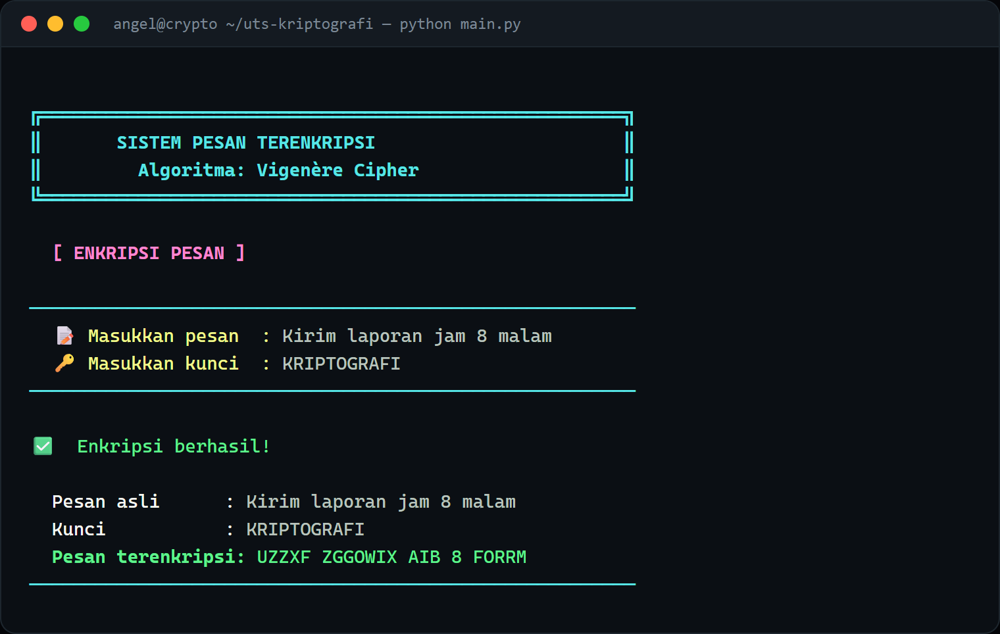

# Vigenère Cipher Messenger

A terminal app for encrypting and decrypting messages with the **Vigenère cipher**, and for sending those encrypted messages to another machine over TCP. Built as a Semester 4 Cryptography midterm project.



## Overview

The Vigenère cipher is a classic polyalphabetic substitution cipher: each letter of the message is shifted by an amount taken from a repeating keyword. This project implements the cipher from scratch and wraps it in a small terminal UI that can also ship a ciphertext across the local network — one terminal listens, another sends.

## Features

- **Encrypt / decrypt** any message with a keyword
- **Send** an encrypted message to another machine over TCP (IP + port)
- **Receive** an incoming encrypted message and optionally decrypt it on the spot
- Case-insensitive keys; non-letter characters (spaces, digits, punctuation) pass through unchanged
- Input validation and friendly error messages throughout

## How it works

Letters are mapped to `0–25`. For each letter of the message, the cipher adds the value of the corresponding key letter (the key repeats to match the message length) modulo 26:

```
encrypt:  c = (p + k) mod 26
decrypt:  p = (c − k) mod 26
```

For example, `HELLO` with the key `KEY` encrypts to `RIJVS`.

## Requirements

- Python 3.9+ (standard library only; `pytest` is used for the tests)

## Setup & run

```bash
git clone https://github.com/GianneAngely/uts-kriptografi-semester-4.git
cd uts-kriptografi-semester-4
python main.py
```

## Menu

| Key | Action |
|-----|--------|
| `1` | Encrypt a message |
| `2` | Decrypt a message |
| `3` | Send an encrypted message to an IP address |
| `4` | Receive an encrypted message from the network |
| `5` | Exit |

## Sending over the network

Run the app on two machines on the same network (or two terminals on one machine):

1. On the **receiver**, choose `[4]` and pick a port (default `5000`). It starts listening.
2. On the **sender**, choose `[3]`, type the message and key, then enter the receiver's IP and the same port.
3. The receiver shows the incoming ciphertext and can decrypt it by entering the shared key.

The key is never transmitted — only the ciphertext travels over the wire.

## Tests

```bash
pip install pytest
pytest
```

`tests/test_crypto.py` covers encryption, decryption, round-trips, case handling, and non-letter passthrough.

## Project layout

- `main.py` — terminal UI and menu flow
- `crypto.py` — the Vigenère encrypt / decrypt implementation
- `network.py` — TCP send / receive helpers
- `tests/` — unit tests for the cipher

## Note

The Vigenère cipher is a historical teaching cipher and is **not secure** for protecting real data. This project is for learning how classical cryptography works, not for production use.
